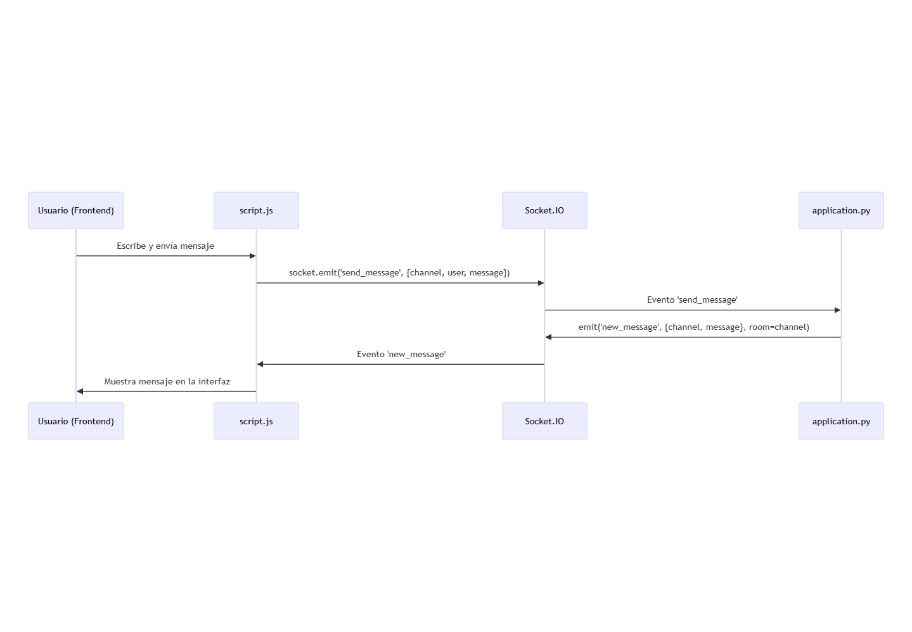

# Flack Chat - CS50W Project 2

This is my solution for **CS50W Project 2: Flack**, a real-time web chat application built with Flask and Socket.IO, similar to Slack.

🗪 README.md en español: [README_ES.md](README_ES.md)

## Project Description

Flack is a real-time messaging application that allows users to:

* Register with a display name that persists between sessions
* Create and join chat channels
* Send and receive messages in real time
* Delete their own messages (extra feature)
* Remember the last channel visited when the page reloads

## Implemented Features

### ✅ Core Requirements

1. **Display Name**: Requested from the user on first visit and stored in localStorage
2. **Channel Creation**: Users can create new channels (with unique names)
3. **Channel List**: Available channels are listed and selectable
4. **Messages View**: Messages are displayed per channel (up to 100 per channel)
5. **Sending Messages**: Messages are sent and received in real time
6. **Remembering the Channel**: The current channel is remembered after page reload

### 🎯 Personal Touch (Extra Feature)

**Delete Own Messages**: Users can delete only their own messages by clicking the "X" button that appears next to each of their messages.

## Project Structure

```
flack/
├── application.py              # Main backend using Flask and Socket.IO
├── requirements.txt            # Project dependencies
├── static/
│   ├── css/
│   │   └── styles.css          # Application styling
│   ├── js/
│   │   └── script.js           # Frontend logic and communication
│   └── images/
│       ├── diagram_channels.svg    # Channel creation diagram
│       ├── diagram_messages.svg    # Message sending diagram
│       └── diagram_delete.svg      # Message deletion diagram
├── templates/
│   └── index.html              # Main interface
└── README.md                   # This file
```

## Technologies Used

* **Backend**: Flask, Flask-SocketIO
* **Frontend**: HTML5, CSS3, JavaScript (ES6+)
* **Real-time communication**: Socket.IO
* **Local storage**: localStorage (browser)
* **Server-side storage**: In-memory global variables

## How to Run the Project

1. **Install dependencies**:

   ```bash
   pip install -r requirements.txt
   ```

2. **Set environment variables**:

   ```bash
   # On Windows (PowerShell):
   $env:SECRET_KEY = "secret"
   $env:FLASK_APP = "application.py"

   # On Windows (CMD):
   set SECRET_KEY=secret
   set FLASK_APP=application.py

   # On Mac/Linux:
   export SECRET_KEY="secret"
   export FLASK_APP="application.py"
   ```

3. **Run the application**:

   ```bash
   flask run
   # Or alternatively:
   python application.py
   ```

4. **Open in browser**:
   Navigate to `http://127.0.0.1:5000`

## Socket.IO Event Flow Diagrams

### 1. Channel Creation


### 2. Message Sending



### 3. Message Deletion


## Technical Features

* **Real-time communication**: Implemented with Socket.IO for instant messaging
* **Local persistence**: Display name and current channel are stored in localStorage
* **Room management**: Users are automatically joined to the selected channel’s room
* **Message limit**: A maximum of 100 messages per channel (oldest are discarded)
* **Responsive UI**: Interface adapts to different screen sizes
* **Data validation**: Ensures unique usernames and channel names

## Development Notes

* All data is stored in server memory (global variables) as specified in the project instructions
* No database is used, in compliance with CS50W requirements
* The application handles automatic reconnections via Socket.IO
* All events are documented in the flow diagrams

---

**Developed as part of CS50's Web Programming with Python and JavaScript course**
