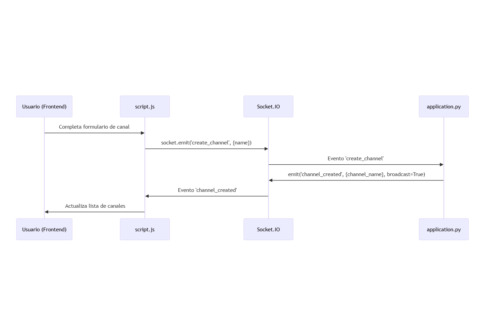
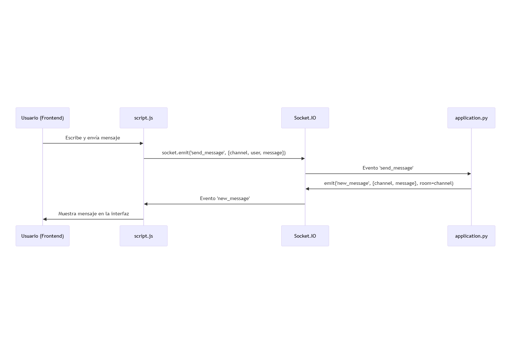
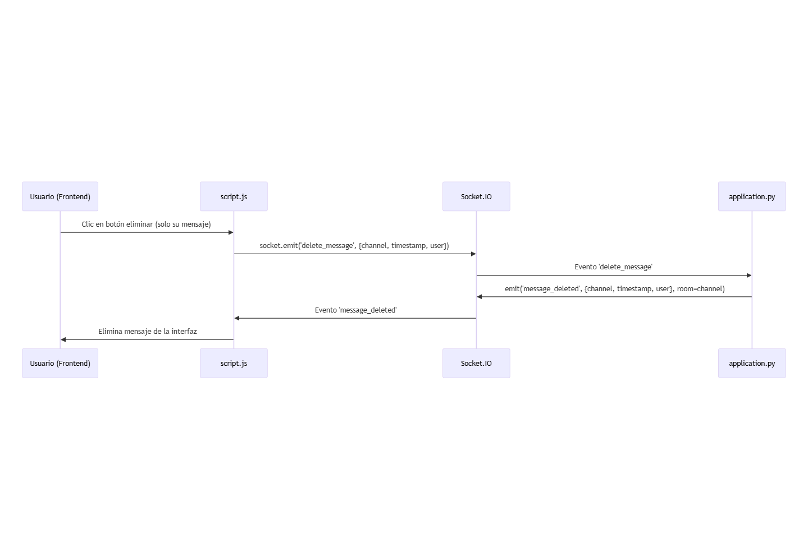

# Flack Chat - CS50W Project 2

Esta es mi solución para el **CS50W Project 2: Flack**, una aplicación web de chat en tiempo real desarrollada con Flask y Socket.IO, similar a Slack.

## Descripción del Proyecto

Flack es una aplicación de mensajería en tiempo real que permite a los usuarios:
- Registrarse con un nombre de usuario que se recuerda entre sesiones
- Crear y unirse a canales de chat
- Enviar y recibir mensajes en tiempo real
- Eliminar sus propios mensajes (funcionalidad extra)
- Recordar el canal en el que estaban al recargar la página

## Funcionalidades Implementadas

### ✅ Requisitos Principales
1. **Display Name**: Se solicita al usuario la primera vez y se guarda en localStorage
2. **Channel Creation**: Los usuarios pueden crear canales nuevos (nombres únicos)
3. **Channel List**: Lista de canales disponibles para seleccionar
4. **Messages View**: Visualización de mensajes por canal (máximo 100 por canal)
5. **Sending Messages**: Envío y recepción de mensajes en tiempo real
6. **Remembering the Channel**: El canal actual se recuerda al recargar la página

### 🎯 Personal Touch (Funcionalidad Extra)
**Eliminación de mensajes propios**: Los usuarios pueden eliminar únicamente sus propios mensajes haciendo clic en el botón "X" que aparece junto a cada mensaje que han enviado.

## Estructura del Proyecto

```
flack/
├── application.py              # Backend principal con Flask y Socket.IO
├── requirements.txt            # Dependencias del proyecto
├── static/
│   ├── css/
│   │   └── styles.css          # Estilos de la aplicación
│   ├── js/
│   │   └── script.js           # Lógica del frontend y comunicación
│   └── images/
│       ├── diagram_channels.svg    # Diagrama de creación de canales
│       ├── diagram_messages.svg    # Diagrama de envío de mensajes
│       └── diagram_delete.svg      # Diagrama de eliminación de mensajes
├── templates/
│   └── index.html              # Interfaz principal
└── README.md                   # Este archivo
```

## Tecnologías Utilizadas

- **Backend**: Flask, Flask-SocketIO
- **Frontend**: HTML5, CSS3, JavaScript (ES6+)
- **Comunicación en tiempo real**: Socket.IO
- **Almacenamiento local**: localStorage (navegador)
- **Almacenamiento en servidor**: Variables globales en memoria

## Cómo Ejecutar el Proyecto

1. **Instalar dependencias**:
   ```bash
   pip install -r requirements.txt
   ```

2. **Configurar variables de entorno**:
   ```bash
   # En Windows (PowerShell):
   $env:SECRET_KEY = "secret"
   $env:FLASK_APP = "application.py"
   
   # En Windows (CMD):
   set SECRET_KEY=secret
   set FLASK_APP=application.py
   
   # En Mac/Linux:
   export SECRET_KEY="secret"
   export FLASK_APP="application.py"
   ```

3. **Ejecutar la aplicación**:
   ```bash
   flask run
   # O alternativamente:
   python application.py
   ```

4. **Abrir en el navegador**:
   Navega a `http://127.0.0.1:5000`

## Diagramas de Flujo de Eventos Socket.IO

### 1. Creación de salas



### 2. Envío de mensajes



### 3. Eliminación de mensajes



## Características Técnicas

- **Comunicación en tiempo real**: Implementada con Socket.IO para mensajes instantáneos
- **Persistencia local**: Display name y canal actual se guardan en localStorage
- **Gestión de salas**: Los usuarios se unen automáticamente a la sala del canal seleccionado
- **Límite de mensajes**: Máximo 100 mensajes por canal (se eliminan los más antiguos)
- **Interfaz responsiva**: Diseño adaptable para diferentes tamaños de pantalla
- **Validación de datos**: Verificación de nombres de usuario y canales únicos

## Notas de Desarrollo

- Los datos se almacenan en memoria del servidor (variables globales) como especifica el proyecto
- No se utiliza base de datos para cumplir con los requisitos de CS50W
- La aplicación maneja reconexiones automáticas de Socket.IO
- Todos los eventos están documentados en los diagramas de flujo

---

**Desarrollado como parte del curso CS50's Web Programming with Python and JavaScript**
